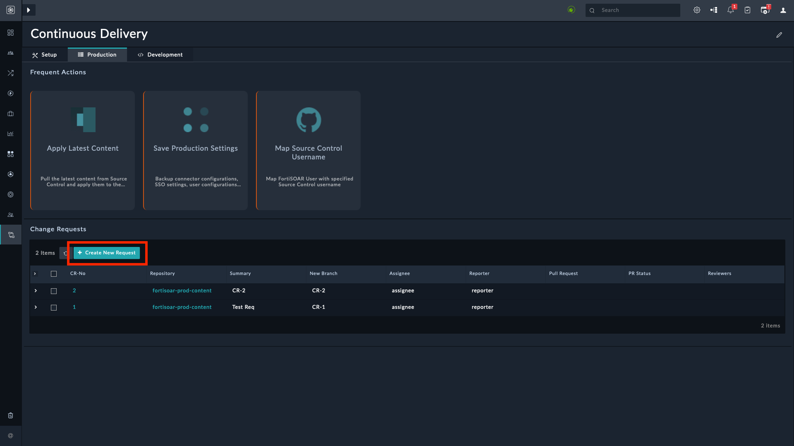

# Release Information

- **Version**: 1.1.0

- **Certified**: Yes

- **Publisher**: Fortinet  

- **Compatibility**: 7.4.3 and later

- **Applicable**: View Panel and Listing View

- [Release Notes](./widget/release_notes.md)

# Overview

The **JSON to Grid** widget streamlines data visualization and interaction. It transforms JSON data from selected playbooks into a structured grid view, enhancing readability. Users can also customize the grid by adding action buttons that further execute selected playbooks, facilitating efficient workflow management and analysis.

|  |  |
|:----------------------------------------------------------------------------------------------:|:------------------------------------------------------------------------------------------:|
|                          JSON to Grid widget with no record selected                           |                         JSON to Grid widget with a record selected                         |

## Next Steps

| [Installation](./docs/setup.md#installation) | [Configuration](./docs/setup.md#configuration) | [Usage](./docs/usage.md) |
|----------------------------------------------|------------------------------------------------|--------------------------|
