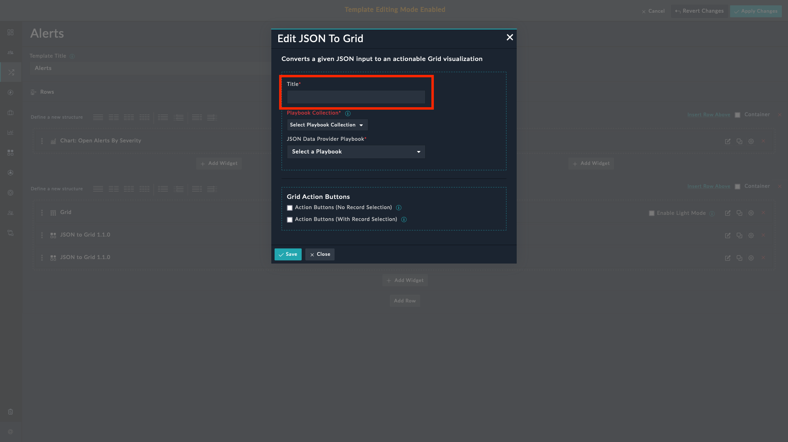
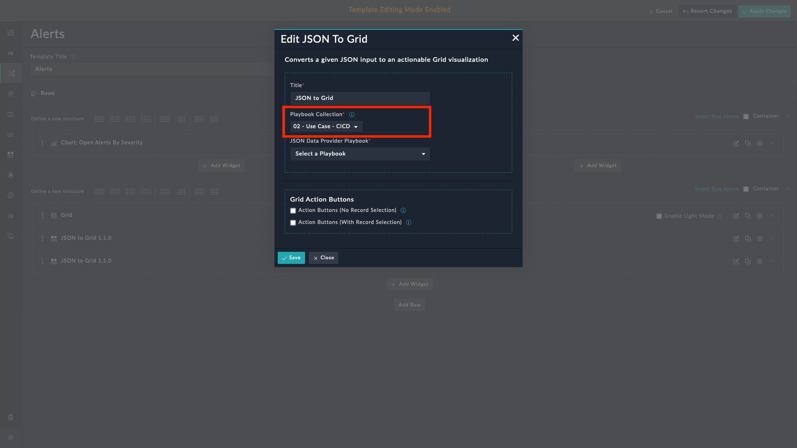
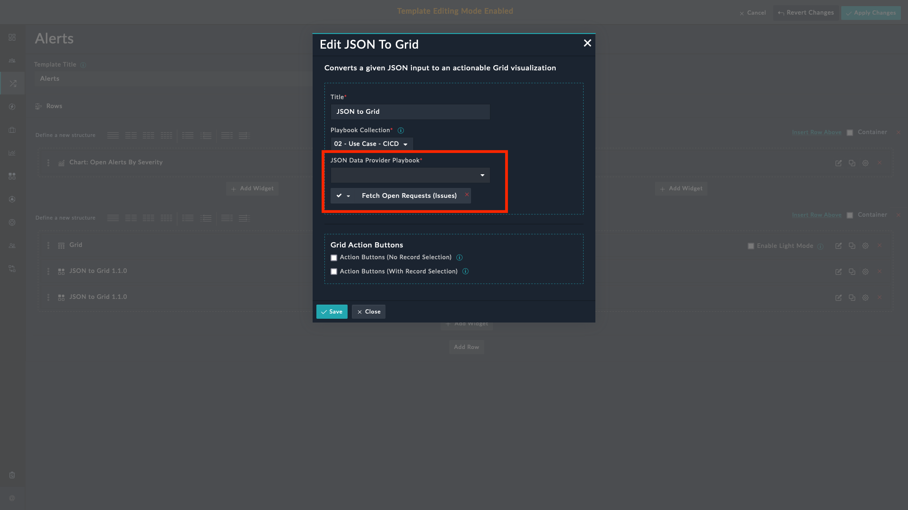
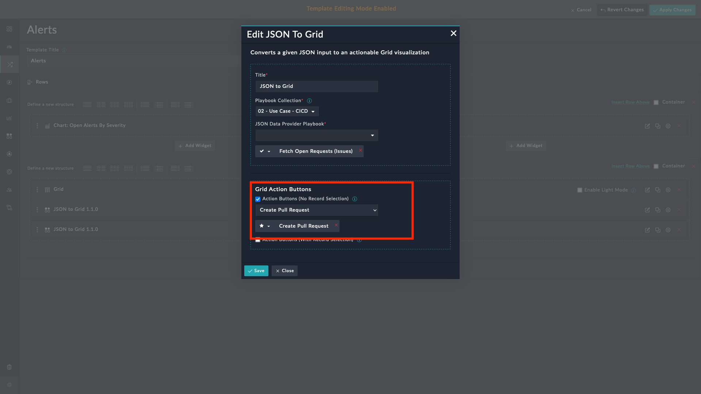
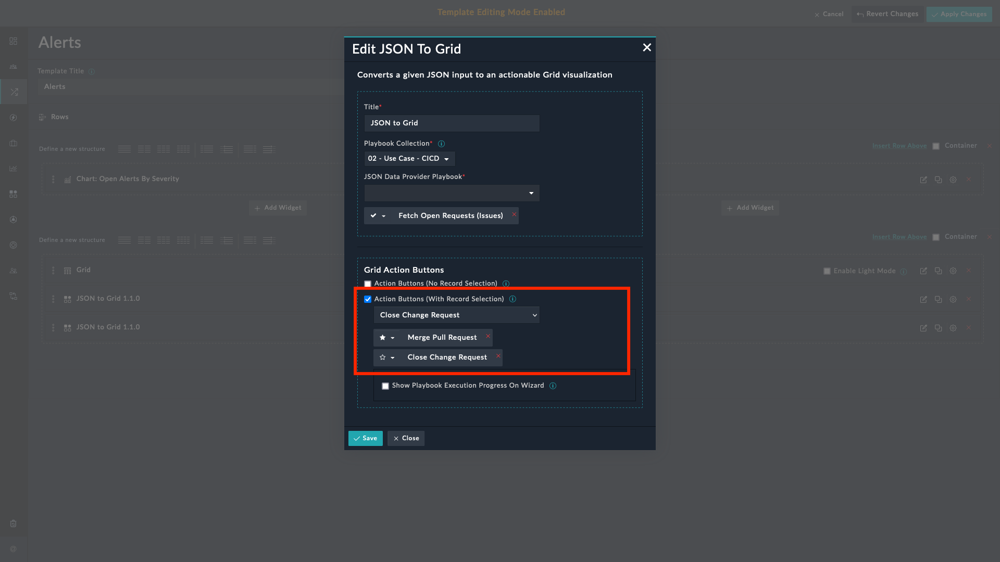
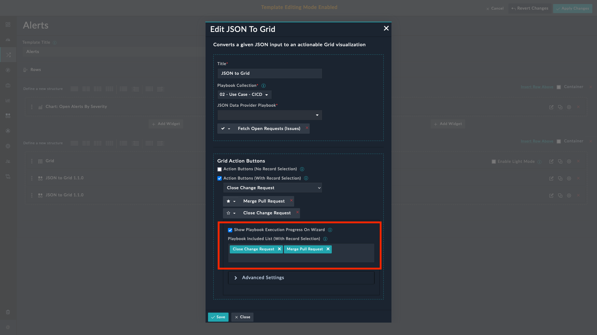
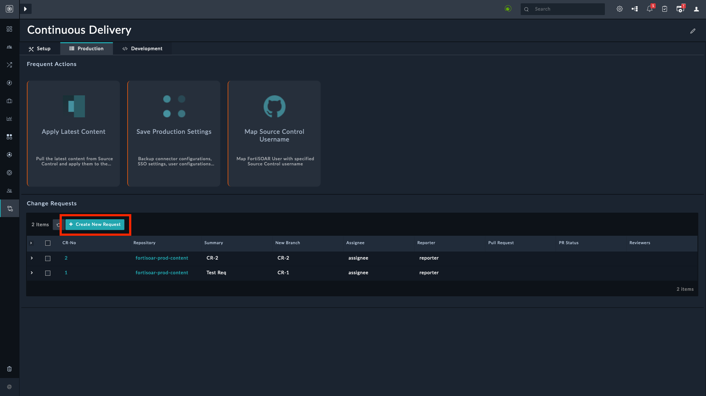
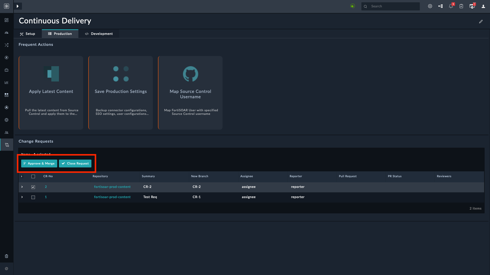

| [Home](../README.md) |
|--------------------------------------------|

# Usage

The JSON to Grid widget helps render the JSON list result returned from the **JSON Data Provider** Playbook in a grid view. It also has the option to add playbooks as action buttons.

## Features

- Configure the widget by choosing *Title*, *Playbook Collection*, *Playbooks*, and *Icons*

- Visualize the JSON data result from the playbook specified under the `JSON Data Provider Playbook` field

- Execute the playbooks either when **_no records are selected_** or when one or more **_records are selected_** on grid data

    <table>
        <tr>
            <th>NOTE</th>
        </tr>
        <tr>
            <td>The playbook <em>JSON Data Provider</em> must return <strong>two</strong> variables:
                <ol>
                    <li><code>grid_data</code>: Contains the list of JSON data to render on grid view. Every record should have a unique IRI (<code>@id</code>) field.</li>
                    <li><code>grid_columns</code>: Map <code>grid_data</code> variable fields with the column fields of the grid.</li>
                </ol>
            </td>
        </tr>
    </table>

## Configuring JSON to Grid Widget

In this section, we use *Continuos Delivery* solution pack as an example for configuring the **JSON to Grid** widget.

1. Edit a module's view template and select the **Add Widget** button.

2. Select **JSON to Grid** from the list of installed widgets.

3. Specify a title of the widget in the **Title** field.

    

4. Select the playbook collection containing the playbooks to execute. This collection must also contain the playbooks to be executed as action buttons.

    As an example, select the collection **02 - Use Case - CICD**.

    

5. Select the playbook that returns the JSON data to be rendered in the grid view.

    

6. Select the checkbox **Action Buttons (No Record Selection)**

    - Select playbooks to be executed when no records are selected.

        

7. Select the checkbox **Action Buttons (With Record Selection)**

    - Select playbooks to be executed when one or more records are selected.

        

8. Select the playbooks whose execution progress is to be displayed by the wizard.

    

>You can download this [Sample - JSON to Grid (ZIPPED)](./res/Sample-JSON-to-grid.zip) collection and import using the FortiSOAR&trade;'s import wizard to try out this widget. **_The ZIP file contains a playbook that generates a sample grid data._**

## JSON to Grid Widget Views

|  |  |
|:----------------------------------------------------------------------------------------------:|:------------------------------------------------------------------------------------------:|
|                          JSON to Grid widget with no record selected                           |                         JSON to Grid widget with a record selected                         |

## Next Steps

| [Installation](./setup.md#installation) | [Configuration](./setup.md#configuration) |
|-----------------------------------------|-------------------------------------------|