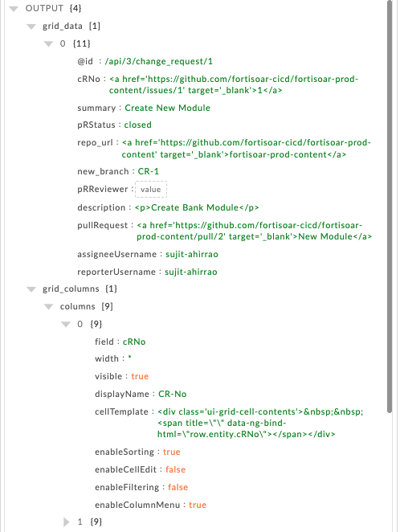
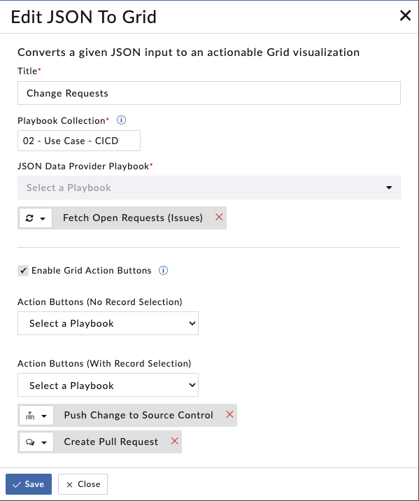
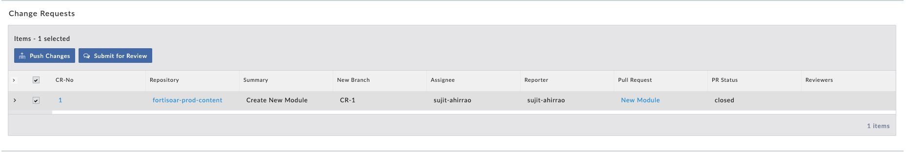

| [Home](../README.md) |
|--------------------------------------------|

# Usage

The JSON to Grid widget helps render the JSON list result returned from the `JSON Data Provider Playbook` in the grid view.

Following pointers showcase how this widget seamlessly integrates with a solution pack such as **Continuous Delivery**:

- Execute the playbook with `No Record Selection` and `With Record Selection` on grid data.

- Add this view on a list view or detail view of a module's record.

## Features

- Helps users configure the widget by choosing *Title*, *Playbook Collection*, *Playbooks*, and *Icons*

- Helps users visualize the JSON data result from the playbook specified under the `JSON Data Provider Playbook` field

- Helps users execute the playbook on `No Record Selection` and `With Record Selection` on grid data

    >**NOTE**: Ensure that `JSON Data Provider Playbook` should returns two variables 
    >
    >    1. `grid_data`: Contain the list of JSON data that you want to render on grid view. Every record should have a unique IRI(`@id`) field.
    >    
    >    2. `grid_columns`: Map `grid_data` variable fields with the column fields of the grid.

- The following screenshot shows sample contents of the `grid_data` and `grid_columns` variable

    

## Scenario

- Download [Sample - JSON to Grid](./res/Sample%20-%20JSON%20to%20Grid.zip) playbook and import into FortiSOAR server.

- Add JSON to Grid widget to the list view of any module.

- Configure the widget by selecting `Playbook Collection` as **Sample - JSON to Grid** and `JSON Data Provider Playbook` as **JSON to Grid** playbook.

## JSON to Grid Widget Views

### JSON to Grid Widget - Edit View

### JSON to Grid Widget - List View

